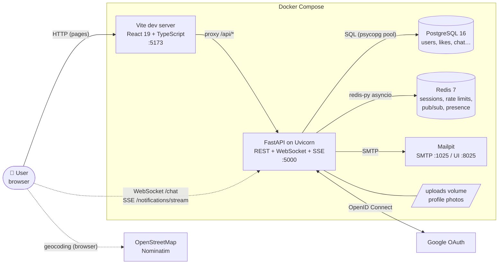
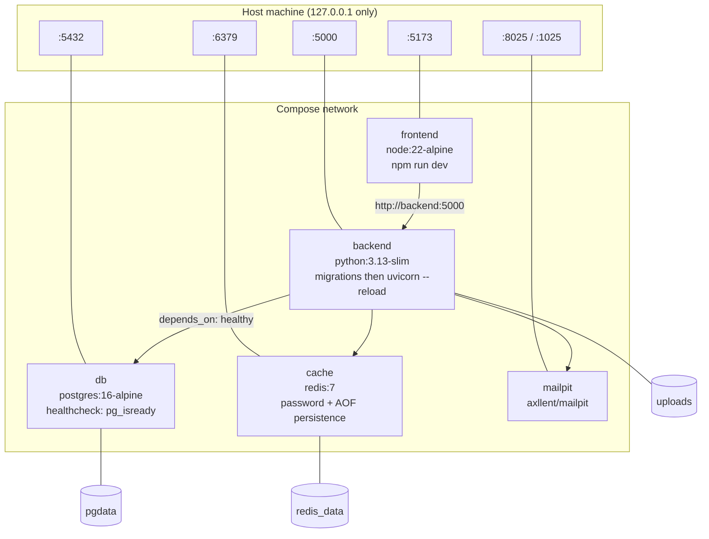
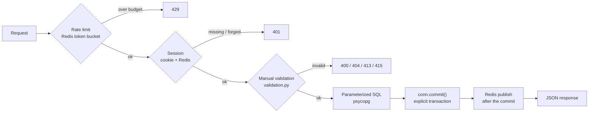
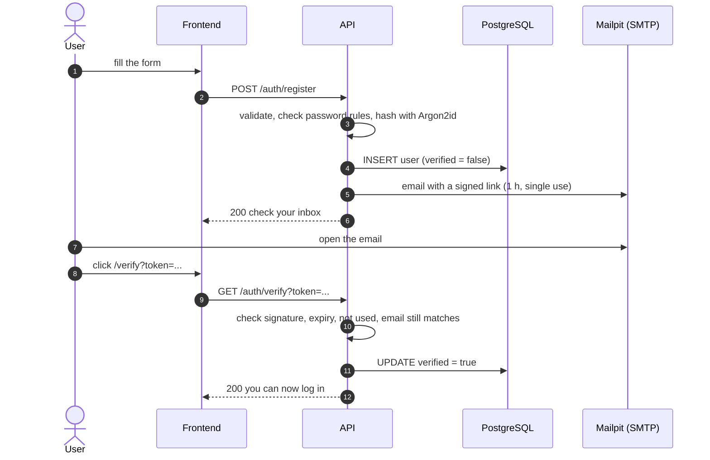
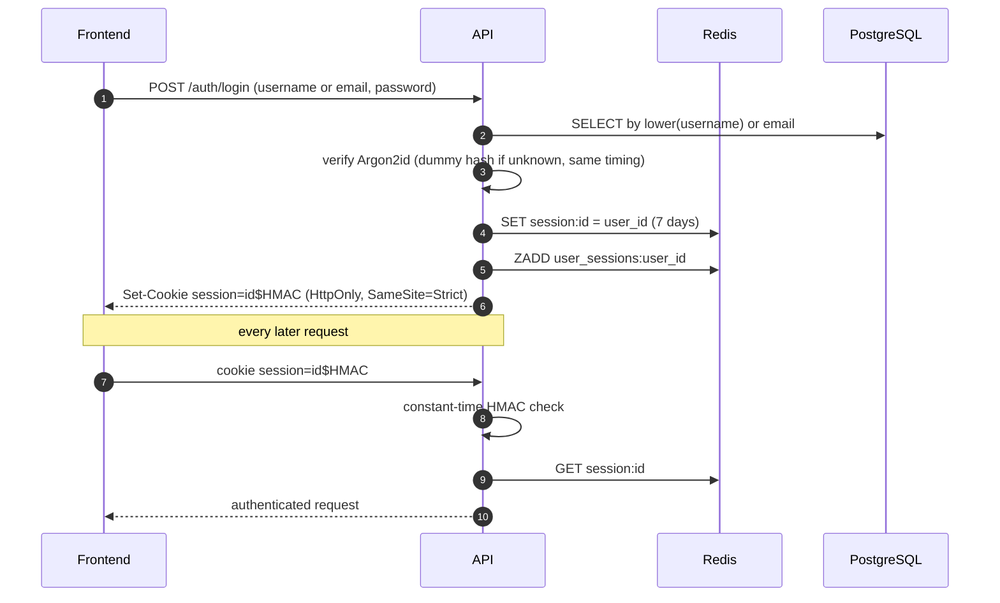
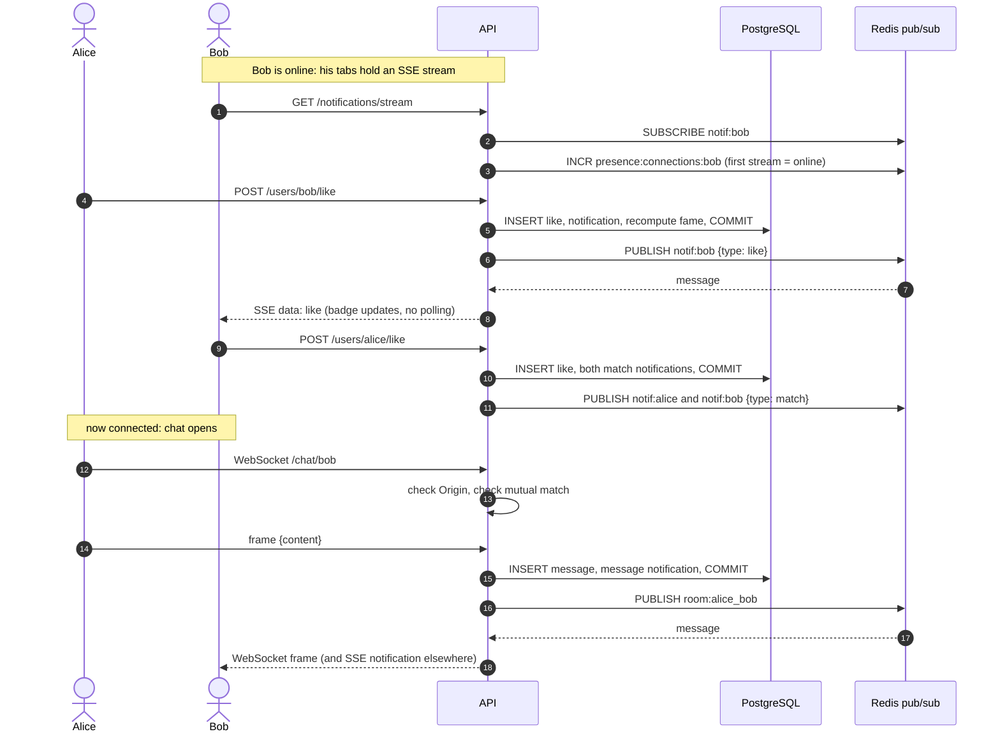
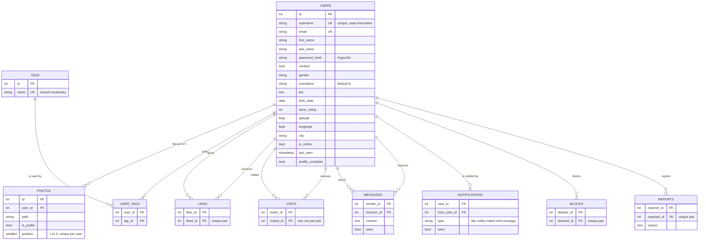
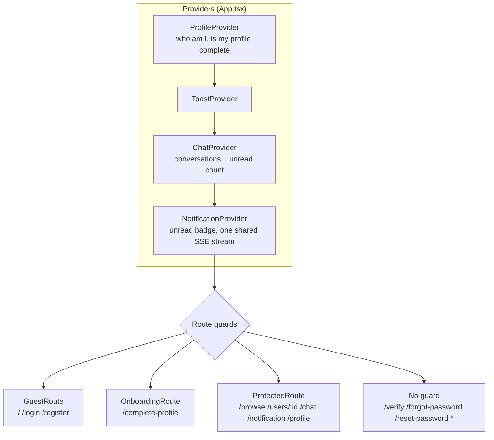

<div align="center">


# Matcha

**A real-time dating web app: sign up, build a profile, get matched suggestions, like, chat and get notified instantly.**

[](https://fastapi.tiangolo.com/)
[](https://react.dev/)
[](https://www.typescriptlang.org/)
[](https://www.postgresql.org/)
[](https://redis.io/)
[](https://docs.docker.com/compose/)
[](#testing)

[Quick start](#-quick-start) · [Architecture](#-architecture) · [API](#-api-reference) · [Configuration](#-configuration) · [Development](#-development) · [Security](#-security)

</div>

> A 42 school project. No ORM and no validation library on purpose: every SQL query is written by hand with bound parameters, and every input is checked by hand in one module ([`backend/app/validation.py`](backend/app/validation.py)).

---

## Table of contents

1. [Features](#-features)
2. [Quick start](#-quick-start)
3. [Architecture](#-architecture)
   - [System overview](#system-overview)
   - [Deployment](#deployment-docker-compose)
   - [Request pipeline](#request-pipeline)
   - [Key flows](#key-flows)
   - [Data model](#data-model)
   - [Redis keyspace](#redis-keyspace)
   - [Frontend structure](#frontend-structure)
   - [Design decisions](#design-decisions)
4. [How matching works](#-how-matching-works)
5. [API reference](#-api-reference)
6. [Security](#-security)
7. [Configuration](#-configuration)
8. [Development](#-development)
9. [Project structure](#-project-structure)
10. [Evaluation checklist](#-evaluation-checklist)
11. [Troubleshooting](#-troubleshooting)

---

## ✨ Features

| Area | What you can do |
|---|---|
| **Accounts** | Register with email, **username**, names and password (common passwords refused). Confirm by email link before the account works. Log in with username **or** email. Reset a forgotten password by email. Google sign-in. Log out from any page, including on mobile. |
| **Profile** | Gender, orientation, bio, interests (tags), up to 5 photos with a profile picture, birth date, location (GPS or typed city). Every field, including username and email, can be edited at any time. |
| **Suggestions** | Profiles compatible with your orientation, ranked by common interests, fame, age gap and distance. |
| **Search** | Filter by age, distance, fame range, number of shared interests and **specific interests**. Sort by best match, age, distance, fame or shared interests. |
| **Interactions** | Like / unlike (a profile picture of your own is required), matches, block, report as a fake account, see who visited you and who liked you, see whether someone likes you, online status and last seen. |
| **Chat** | Real-time messages between matched users only. Unread badge on every page. |
| **Notifications** | Real-time for likes, visits, messages, matches and unlikes, with an unread badge on every page. |
| **Quality of life** | Responsive layout down to phone width, friendly 404 page, toasts for every error and success. |

---

## 🚀 Quick start

**Requirements:** [Docker](https://docs.docker.com/get-docker/) with Compose. Nothing else.

```bash
# 1. Configuration: copy the template, then replace every "change-me"
#    (generate a secret with: openssl rand -hex 32)
cp .env.example .env

# 2. Build and start everything. The database schema is created automatically:
#    pending migrations run before the API starts.
docker compose up --build

# 3. In a second terminal, fill the database with 500 fake profiles
docker compose exec backend python -m app.seed
```

| What | Where |
|---|---|
| The app | <http://localhost:5173> |
| The API (interactive docs at `/docs`) | <http://localhost:5000> |
| Emails sent by the app (verification, password reset) | <http://localhost:8025> (Mailpit) |
| PostgreSQL / Redis | `localhost:5432` / `localhost:6379` |

### Try it in 2 minutes

1. **Register** with an email, a username, your names and a password.
2. Open **Mailpit** (<http://localhost:8025>) and click the verification link: the account cannot log in before that.
3. **Log in** with your username (or email) and complete your profile. A profile picture is required to like someone.
4. The 500 seeded profiles live around Thai cities (Bangkok, Chiang Mai, Phuket…). Their passwords are random: to see a match, a chat or live notifications, **register a second account in a private window**, like each other and open the chat.

### Start over from nothing

```bash
docker compose down -v   # deletes the database and the uploaded photos
```

---

## 🏗 Architecture

All diagrams are [Mermaid](https://mermaid.js.org/): they render on GitHub and live in this file, so they change in the same pull request as the code.

### System overview



The browser only ever talks to the Vite server (same origin, no CORS in development); Vite forwards `/api/...` to the API with the prefix stripped. Real-time channels (WebSocket for chat, Server-Sent Events for notifications) are served by the same FastAPI process.

### Deployment (Docker Compose)



- Every port is published on `127.0.0.1` only: nothing is exposed to the network.
- The `backend` container runs the pending migrations, then `uvicorn` with `--timeout-graceful-shutdown 3`: without it, an open SSE stream would make every reload and every stop wait forever.
- Hostnames are the Compose service names (`db`, `cache`, `backend`, `mailpit`).

### Request pipeline

Every route follows the same order, so a hostile request is stopped as early and as cheaply as possible.



The notification event is published **after** the commit, so a client never receives a live notification for a write that then failed.

### Key flows

<details open>
<summary><b>Sign-up and email verification</b></summary>


</details>

<details>
<summary><b>Login and session</b></summary>


</details>

<details>
<summary><b>Like, match, notification and chat in real time</b></summary>


</details>

### Data model



- Migrations are numbered `.sql` files in [`backend/app/db/migrations/`](backend/app/db/migrations). The runner applies the pending ones in order, one commit per file. **Add a new file instead of editing an applied one.**
- A *match* is not a table: two likes in opposite directions. `GET /users/{id}` returns `is_liked_by_me`, `likes_me` and `is_match` from the same `likes` table.
- Geography uses the `cube` and `earthdistance` extensions (migration `001`).
- `(user_id, position)` uniqueness on photos is `DEFERRABLE INITIALLY DEFERRED`, so swapping two photos in one transaction never violates it.

### Redis keyspace

| Key | Type | TTL | Purpose |
|---|---|---|---|
| `session:<id>` | string | 7 days | The session: id → user id |
| `user_sessions:<user_id>` | sorted set | | A user's session ids (scored by expiry), used to revoke other sessions after a password reset |
| `used_verify:<token>` / `used_reset:<token>` | string | 1 h / 30 min | Makes emailed links single use |
| `oauth_state:<state>` | string | 5 min | Anti-CSRF state of the Google flow |
| `rl:<scope>:ip:<addr>` / `rl:<scope>:account:<id>` | hash | self-expiring | Token buckets (one per budget) |
| `notif:<user_id>` | pub/sub channel | | Live notifications for one user |
| `room:<min_id>_<max_id>` | pub/sub channel | | Chat room of two matched users |
| `presence:connections:<user_id>` | counter | | Open notification streams of a user |

### Frontend structure



| Layer | Folder | Role |
|---|---|---|
| Pages | `frontend/src/pages` | One component per route |
| Components | `frontend/src/components` | UI, grouped by feature (`browse`, `chat`, `profile`, `userProfile`, `notifications`, `onboarding`) |
| Hooks | `frontend/src/hooks` | Data loading and actions (`useLike`, `useChat`, `useBrowseProfiles`…) |
| Context | `frontend/src/context` | Shared state: auth/profile, chat, notifications, browse, toasts |
| API | `frontend/src/api` | One thin `fetch` wrapper per backend area; always `credentials: 'include'` |
| Lib | `frontend/src/lib` | Pure helpers (dates, filters, geocoding) |

The authentication state has four values (`loading`, `guest`, `incomplete`, `complete`) derived once by `ProfileProvider`; every guard reads it, so redirects are consistent. A single shared `EventSource` serves both the notification badge and the chat badge.

**UI stack:** Tailwind CSS v4 (theme tokens in `src/index.css`), [Base UI](https://base-ui.com/) primitives, `lucide-react` icons, `motion` for animation.

### Design decisions

| Decision | Why |
|---|---|
| **No ORM, no Pydantic validators** | School constraint, and it keeps every query and every check visible. Handlers take a raw `Request`; [`validation.py`](backend/app/validation.py) holds all the checks. |
| **Sessions in Redis, not JWT** | A session can be revoked instantly (logout, password reset). The cookie carries only an id plus an HMAC. |
| **Argon2id** | Memory-hard hashing. Login always runs a verification (dummy hash for unknown accounts) so timing never reveals whether an account exists. |
| **Rate limiting in a Redis Lua script** | One atomic round trip: 50 concurrent requests against a budget of 5 let exactly 5 through (tested against a real Redis). |
| **SSE for notifications, WebSocket for chat** | Notifications only flow server to client, so SSE is simpler and reconnects by itself. Chat needs both directions. |
| **Redis pub/sub as the real-time bus** | Events reach the right user whichever process holds their connection. |
| **Presence = open notification streams** | Counted per user in Redis, so several tabs work and the database is written only on the first and last stream. |
| **Closed tag vocabulary** | Tags stay reusable and searchable; users pick from `GET /tags`. |
| **Explicit transactions** | Connections are not autocommit: handlers commit, and publish only after the commit. |
| **Photos re-encoded and served through the API** | Content is checked by magic bytes and Pillow, never by the client's file name or declared type, and only logged-in users can fetch a photo. |
| **Migrations at container start** | A fresh database is ready with no manual step; the migration runner is idempotent. |

---

## 💘 How matching works

**Who can appear in your suggestions:** verified users with a complete profile and a location, excluding yourself, anyone you blocked or who blocked you, and anyone not compatible with your orientation.

| Your orientation | You see |
|---|---|
| `hetero` (male or female) | the opposite gender, who is `hetero` or `bi` |
| `homo` | the same gender, who is `homo` or `bi` |
| `bi` (the default) | everyone |

**Ranking:**

```text
score = 20 × (tags in common)  +  0.5 × fame  −  |age gap|  −  0.1 × distance in km
```

**Fame rating** = likes received + how many of those are reciprocated (matches). It is recomputed in the same transaction as every like, unlike and block.

**Search parameters** of `GET /users` (all optional, all validated before the query runs):

| Parameter | Meaning |
|---|---|
| `min_age`, `max_age` | Age range (16 to 120) |
| `max_distance` | Kilometres from you (0 to 40 000) |
| `min_fame`, `max_fame` | Fame range |
| `min_tags` | At least N interests in common with you (0 to 5) |
| `tags=beach,tech` | Profiles that carry **all** the named interests (at most 5) |
| `sort` | `score` (default), `age`, `distance`, `fame` or `tags` |
| `order` | `asc` or `desc` (each sort has a sensible default) |
| `page` | 0-based, 20 per page. Ties are broken by id, so pages never overlap. |

---

## 📡 API reference

Base URL `http://localhost:5000` (or `/api/...` through the frontend). Authentication is the `session` cookie. Interactive documentation: <http://localhost:5000/docs>.

<details>
<summary><b>Authentication</b></summary>

| Method | Route | Auth | Limit | Description |
|---|---|---|---|---|
| POST | `/auth/register` | | 5/h per IP | Create an account (`email`, `username`, `first_name`, `last_name`, `password`) and send the verification email |
| GET | `/auth/verify?token=` | | | Confirm the email address |
| POST | `/auth/login` | | 10/min per IP (burst 3) | `username` (or email) + `password`; sets the session cookie |
| POST | `/auth/logout` | | | Delete the session and clear the cookie |
| POST | `/auth/forgot-password` | | 3/h per IP | Send a reset link; the answer is the same for unknown addresses |
| POST | `/auth/reset-password` | | | `token` + `new_password`; revokes the user's other sessions |
| GET | `/auth/me` | ✔ | | The current user id |
| GET | `/auth/session` | | | `{authenticated: bool}`, never a 401 |
| GET | `/oauth/google/login` | | 10/min per IP | Start Google sign-in (browser navigation) |
| GET | `/oauth/google/callback` | | | Finish Google sign-in |

</details>

<details>
<summary><b>Profile</b></summary>

| Method | Route | Description |
|---|---|---|
| GET / PUT | `/profile/me` | Read / update any of `username`, `first_name`, `last_name`, `email`, `gender`, `orientation`, `bio`, `birth_date`, `city`, `tags` (100/h). Changing the email re-sends a verification mail. |
| PUT | `/profile/location` | GPS coordinates |
| GET | `/tags` | The tag vocabulary (`?search=`) |
| GET / PUT | `/profile/tags` | Your tags (at most 5) |
| DELETE | `/profile/tags/{name}` | Remove one of your tags |
| GET | `/profile/photos` | Your photos |
| POST | `/profile/photos` | Upload (5/h), JPEG or PNG up to 5 MB, 5 photos maximum |
| GET | `/profile/photos/{position}` | One of your photos |
| PUT | `/profile/photos/{position}/move` | Swap or move a photo |
| DELETE | `/profile/photos/{position}` | Delete a photo |
| GET | `/profile/me/visits` | Who visited you (newest first, 50 at most, blocked users excluded) |
| GET | `/profile/me/likes` | Who liked you (newest first, 50 at most) |
| GET | `/profile/me/blocked` | Users you blocked |

</details>

<details>
<summary><b>Users and interactions</b></summary>

| Method | Route | Limit | Description |
|---|---|---|---|
| GET | `/users` | 30/min per account | Suggestions and search (see [How matching works](#-how-matching-works)) |
| GET | `/users/{id}` | | Public profile; records a visit. Returns `is_liked_by_me`, `likes_me`, `is_match`, `is_online`, `last_seen`. |
| GET | `/users/{id}/photos/{position}` | | A user's photo |
| POST / DELETE | `/users/{id}/like` | 20/min per account | Like / unlike. Needs **your own** profile picture (403 otherwise). |
| POST / DELETE | `/users/{id}/block` | 10/min per account | Block / unblock (blocking removes likes between the two) |
| POST | `/users/{id}/report` | 5/h per account | Report as a fake account (`reason` optional) |

</details>

<details>
<summary><b>Chat and notifications</b></summary>

| Method | Route | Limit | Description |
|---|---|---|---|
| GET | `/chat/conversations` | 30/min | Conversations with last message and unread count |
| GET | `/chat/{id}/messages` | 60/min | History, paginated with `before` and `limit` |
| POST | `/chat/{id}/seen` | 120/min | Mark a conversation as read |
| WS | `/chat/{id}` | 60 frames/min (burst 10) | Real-time chat. Refused unless the `Origin` is the frontend **and** both users like each other. Frames are limited to 16 KB. |
| GET | `/notifications` | | The 50 latest notifications |
| GET | `/notifications/unread-count` | | `{unread: n}` |
| POST | `/notifications/seen` | | Mark everything as read |
| GET | `/notifications/stream` | | Server-Sent Events; keeps the user online |

</details>

Errors are always `{"detail": "..."}` with a meaningful status: `400` invalid input, `401` not logged in, `403` forbidden, `404` not found, `409` conflict (email or username taken), `413` body too large, `415` not JSON, `429` rate limited.

---

## 🔒 Security

| Threat | Defence |
|---|---|
| **Stolen database** | Passwords hashed with Argon2id. Common (10 000-word list), all-letter and all-digit passwords are refused. |
| **SQL injection** | No string-built SQL from user input. Values are always bound parameters; the few dynamic fragments (`ORDER BY`, column lists) come from fixed tables. |
| **XSS** | React escapes everything; the app never uses `dangerouslySetInnerHTML`. A name containing `<script>` is stored as text and shown as text. |
| **CSRF** | `SameSite=Strict` cookie, JSON-only bodies (415 otherwise), CORS limited to the frontend origin. |
| **Session theft / forgery** | `HttpOnly` cookie signed with an HMAC (constant-time check); sessions revocable server-side. |
| **Malicious upload** | Checked by magic bytes and by Pillow, re-encoded to JPEG, limited to 5 MB and 5 photos, stored outside any static route and served only to logged-in users. |
| **Brute force / flooding** | Token-bucket rate limits per IP before login and per account after (see the API tables), including per chat frame. |
| **Account enumeration** | Same answer and same timing for unknown accounts at login and password reset. |
| **Email link abuse** | Signed, expiring, single-use links; a verification link is bound to the address it was issued for. |
| **Hostile input** | Every field is validated before it reaches the database, the hasher or the file system: type, length, control characters, NUL bytes, lone surrogates, integer range. Over 470 tests feed hostile values to every endpoint. |
| **WebSocket hijacking** | `Origin` must match the frontend; max frame size 16 KB; the match is checked before the socket is accepted. |
| **Secrets** | Live in `.env`, which git ignores; the app refuses to start when one is missing. |

---

## ⚙️ Configuration

All configuration comes from environment variables in `.env` (copy [`.env.example`](.env.example)). The backend **refuses to start** when a required one is missing.

| Variable | Required | Description |
|---|---|---|
| `POSTGRES_USER`, `POSTGRES_PASSWORD`, `POSTGRES_DB` | ✔ | Database credentials and name |
| `REDIS_PASSWORD` | ✔ | Redis password |
| `SESSION_SECRET` | ✔ | Signs the session cookie |
| `MAIL_SECRET` | ✔ | Signs the emailed links |
| `ENV` | ✔ | Anything other than `production` lets the cookie work over plain http (localhost) |
| `FRONTEND_URL` | ✔ | Origin of the frontend: used in emailed links and to check the WebSocket `Origin` |
| `GOOGLE_CLIENT_ID`, `GOOGLE_CLIENT_SECRET`, `GOOGLE_REDIRECT_URI` | ✔ | Placeholders are enough to start; Google sign-in needs real credentials |

Compose adds `DATABASE_URL`, `MAIL_HOST` and `MAIL_PORT` by itself.

---

## 🛠 Development

Everything runs in containers, **including tests and lint**: the backend needs the variables from `.env` at import time.

```bash
docker compose logs -f backend                                   # follow the API logs
docker compose exec db psql -U matcha -d matcha                  # database shell
docker compose exec backend python -m app.db.migrations.runner   # apply migrations by hand
docker compose exec backend python -m app.seed                   # fake profiles
```

### Testing

```bash
docker compose exec backend python -m pytest tests/ -v             # ~1300 tests, ~12 s
docker compose exec backend python -m pytest tests/routes/test_users.py -v
docker compose exec frontend npm run lint                          # oxlint
docker compose exec frontend npm run build                         # type-check + production build
```

| Suite | What it proves |
|---|---|
| `tests/routes/` | Every endpoint, with the database and Redis mocked |
| `tests/routes/test_input_validation.py` | Hostile input is refused **and** never reaches the database |
| `tests/routes/test_rate_limits.py` | The budget table matches the decorators |
| `tests/security/test_rate_limit.py` | The token bucket against a **real** Redis: burst, refill, concurrency |
| `tests/test_presence.py`, `tests/test_seed.py`… | Presence counting, seed data, helpers |

### Conventions

- **Routes:** a handler takes a raw `Request`, authenticates with `get_current_user_id`, reads the body with `require_json`, validates every field with `app/validation.py`, and calls `await conn.commit()` itself.
- **Add a route:** create `app/routes/<domain>.py`, then `app.include_router(...)` in `create_app()`. Add a case to `test_input_validation.py` for each new input and to `test_rate_limits.py` for each new budget.
- **Change the schema:** add `NNN_name.sql` to `backend/app/db/migrations/`; never edit an applied one.
- **Docstrings:** Google style (Args, Returns, Raises).
- **Frontend:** plain `fetch` wrappers in `src/api`, logic in hooks, no data fetching in presentational components.

---

## 🗂 Project structure

```text
.
├── docker-compose.yml          # 5 services: frontend, backend, db, cache, mailpit
├── .env.example                # every variable, no secrets
├── backend/
│   ├── Dockerfile
│   ├── app/
│   │   ├── __init__.py         # create_app(), lifespan (pool, Redis, presence reset)
│   │   ├── routes/             # authentification, oauth, profile, users, chat, notifications
│   │   ├── security/           # sessions, Argon2 passwords, signed tokens
│   │   │   └── rate_limiter/   # token bucket (Python + Lua)
│   │   ├── db/                 # connection pool, migrations/*.sql, runner
│   │   ├── presence.py         # who is online
│   │   ├── usernames.py        # username generation (Google sign-in)
│   │   ├── validation.py       # every input check
│   │   ├── utils.py            # JSON body reader, image checks and processing
│   │   └── seed.py             # 500 fake profiles
│   └── tests/                  # ~1300 tests
└── frontend/
    └── src/
        ├── pages/              # one per route
        ├── components/         # grouped by feature
        ├── hooks/ context/     # logic and shared state
        ├── api/                # fetch wrappers
        └── lib/                # pure helpers
```

---

## ✅ Evaluation checklist

Where each point of the 42 evaluation grid lives, for a quick defence.

| Grid item | Where |
|---|---|
| Passwords encrypted, SQL injection, validation | Argon2id (`security/passwords.py`), bound parameters everywhere, `validation.py` + hostile-input tests |
| Install and seed (500 profiles) | [Quick start](#-quick-start); `app/seed.py` creates exactly 500 verified, complete profiles |
| Registration with email, username, names, password; email link | `routes/authentification.py`; the account cannot log in before verification |
| Login with username, password reset by email, logout from any page | `POST /auth/login`, `/forgot-password` + `/reset-password` pages, sidebar logout on desktop and in the mobile bar |
| Extended profile (sex, orientation, bio, tags, 5 photos), editable | `routes/profile.py`, profile page and onboarding wizard |
| Visit history and who liked you | `/profile/me/visits`, `/profile/me/likes`; **Visitors** and **Likes** tabs on the Messages page |
| Fame rating | Likes received + matches, see [How matching works](#-how-matching-works) |
| GPS location, manual fallback, editable | Browser geolocation with a typed-city search (OpenStreetMap), editable on the profile page |
| Suggestions weighted by area, tags and fame; consistent with orientation | `GET /users`, score formula above |
| Advanced search, sort and filters | Filters dialog: age, distance, fame range, shared and specific interests; sort by score, age, distance, fame, tags |
| Public profile, online / last seen | `GET /users/{id}`, `is_online` and `last_seen` fed by `presence.py` |
| Like / unlike, connection, picture required | `POST /users/{id}/like`; "likes you" and "connected" shown on the profile |
| Report and block | Report menu and Block button on every profile; blocked users vanish from suggestions and notifications |
| Real-time chat (≤ 10 s), unread everywhere | WebSocket + Redis pub/sub; badge in the navigation on every page |
| Real-time notifications, unread badge | SSE + Redis pub/sub; the five events of the subject |
| Console clean, no 5xx | Dedicated `/auth/session` route (a visitor is not a 401), catch-all 404 route |
| Mobile | Responsive layout down to phone width |

---

## 🩺 Troubleshooting

| Symptom | Fix |
|---|---|
| The backend exits at start with `RuntimeError … not set` | A variable of `.env` is missing: compare it with `.env.example`. |
| A port is already in use (5000, 5173, 5432, 6379, 8025) | Stop the other program, or change the mapping in `docker-compose.yml`. |
| "Sign in with Google" fails | It needs real Google credentials in `.env`. Username / email login works without them. |
| The verification email never arrives | Open Mailpit at <http://localhost:8025>: all mail goes there, none leaves the machine. |
| `429 Too many requests` while testing | The rate limits are real. Wait a minute, or run `docker compose restart cache` to clear them. |
| The database must be recreated | `docker compose down -v`, then `docker compose up --build` and seed again. |
| A reload hangs | Fixed by `--timeout-graceful-shutdown 3` in Compose; if you run uvicorn yourself, pass the same flag. |

---

<div align="center">

Built for the 42 school **Matcha** project.

</div>
